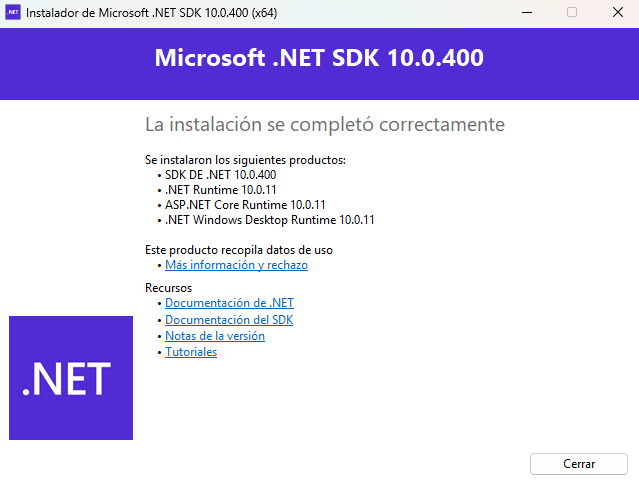
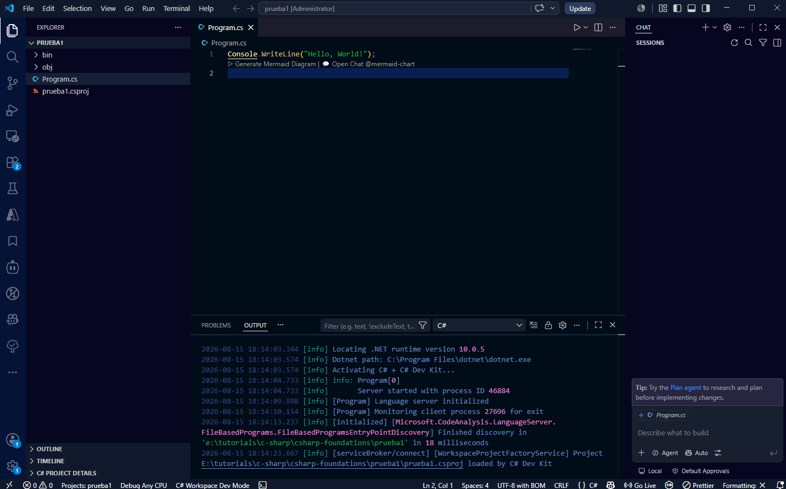
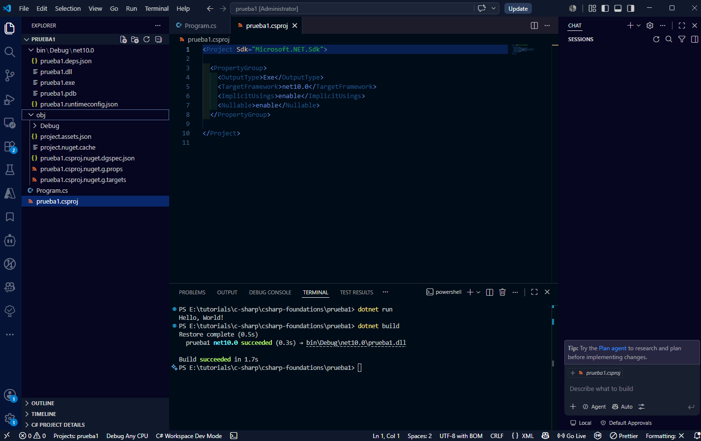
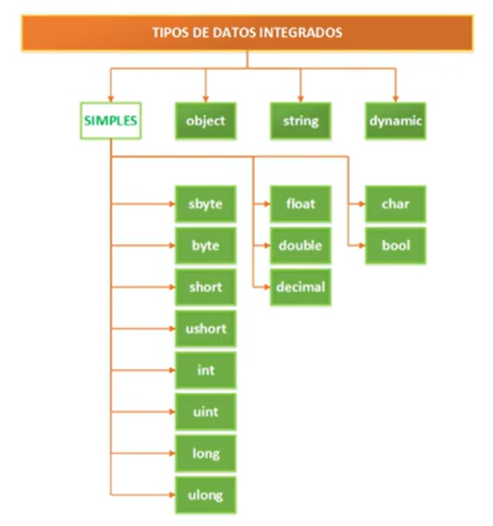

<!-- markdownlint-disable MD012 -->
<!-- markdownlint-disable MD029 -->
<!-- markdownlint-disable MD031 -->
<!-- markdownlint-disable MD032 -->

# CURSO DE C# DESDE CERO 2025

## csharp-foundations

Personal journal of your progress, sounds professional, ideal for solid foundations.

This Learning win wi based on this video list: [Curso de programación con C#](https://www.youtube.com/watch?v=CPPxQlKxQEQ&list=PL2Z95CSZ1N4F7mym8Ca16RoTDVAlIOPlT)

## 2. INSTALACION VISUAL STUDIO 2022 video(2)

>[!IMPORTANT]
>
>Visual Studio vs. Visual Studio Code

1. The instructor suggest in this video [INSTALACION VISUAL STUDIO 2022](https://www.youtube.com/watch?v=5FvYlQ6cpqo&list=PL2Z95CSZ1N4F7mym8Ca16RoTDVAlIOPlT&index=2), but I have installed the [Visual Studio Code](https://code.visualstudio.com/download?_exp_download=fb315fc982).
2. To complete the process I follow this video "[como INSTALAR C# en VISUAL STUDIO CODE 😱](https://www.youtube.com/watch?v=W5naqm7XK9Y)".
3. Download the SDK of .NET from this site [Descargar .NET paraWindows](https://dotnet.microsoft.com/es-es/download), the current version is `SDK versión 10.0.400, publicación 11 de agosto de 2026`.
4. I run the the last file: `dotnet-sdk-10.0.400-win-x64.exe` for _Windows_ and wait for the final message: </br> 


5. To check in a `TERMINAL` I run this command: </br> `dotnet --version` </br>The answer must be like: `10.0.400`.
6. The first test inside the my repository with name `csharp-foundations`, using a  `TERMINAL`, I run this command: </br> `dotnet new console -o prueba1`
7. I get inside the directory: </br> `cd prueba1` </br> and open up another `Visual Studio Code` with the command: `code .`
8. That is I get in this new windows: </br> 


9. I add in VSCode the `C#` extension from [Microsoft](https://www.microsoft.com/), it helps to code completation.
10. Using a `TERMINAL` I run the command: </br> `dotnet run` </br> The answer must be like open a new windows and in the `TERMINAL` this message `Hello, World!`.
11. I can get the _EXE_ file running in the `TERMINAL` the command: </br> `dotnet build` </br> Then I get those files: </br> 


12. Another extension to install in VSCode is [`Material Icon Theme`](https://marketplace.visualstudio.com/items?itemName=PKief.material-icon-theme) from [Philipp Kief](https://marketplace.visualstudio.com/publishers/PKief).
13. Close the last `Visual Studio Code`.
14. Check for the **`.gitignore`** file.

---

## 3. CREAR UN PROYECTO EN C# video(3)

1. How the instructor uses the `Visual Studio`, instead of the simple `Visual Studio Code`, in the first one there are option menu to select the creation type.
2. Moust be sure in the repository directory `csharp-foundations`, if is necessary use the `cd ..` to back to this directory.
3. In our system using a `TERMINAL`, we create a project with the command: </br> `dotnet new console -o console-app1`
4. I change to the new directory using in the `TERMINAL`: </br> `cd console-app1` </br> Then the other command `code .`
5. Following the, I select `Run`->`Start Debugging F5`, it askme for the language, then I select `C#` then what file I'll run.
6. Executes this in the `TERMINAL`:
```bash
 *  Executing task: dotnet: build e:\tutorials\c-sharp\csharp-foundations\console-app1\console-app1.csproj 

dotnet build e:\tutorials\c-sharp\csharp-foundations\console-app1\console-app1.csproj /property:GenerateFullPaths=true /p:Configuration=Debug /p:Platform=AnyCPU /consoleloggerparameters:NoSummary 
C# extension build result service is available.
  Determining projects to restore...
  Restored e:\tutorials\c-sharp\csharp-foundations\console-app1\console-app1.csproj (in 81 ms).
  console-app1 -> e:\tutorials\c-sharp\csharp-foundations\console-app1\bin\Debug\net10.0\console-app1.dll

Build succeeded.
    0 Warning(s)
    0 Error(s)

Time Elapsed 00:00:01.35
 *  Terminal will be reused by tasks, press any key to close it. 
```
7. Finally in another `TERMINAL` window, it shows:
```bash
 & 'c:\Users\pizah\.vscode\extensions\ms-dotnettools.csharp-2.140.9-win32-x64\.debugger\x86_64\vsdbg.exe' '--interpreter=vscode' '--connection=782dc2d3054a4092964e0240742dd72c' 
Hello, World!
```
8. Close the last VSCode, and back in this `TERMINAL` to the directory of repository: `csharp-foundations`.


## 4. TIPOS DE DATOS EN C# video(4)

1. With tis picture a summary of data  types: </br> 


2. Store size of some data types:

<!--||#TABLE-->

|Data type|Bytes|
|-|-:|
|integer|2|
|real|6|
|char|1|
|bool|1|
|pointer|2|

## 5. VARIABLES video(5)

1. We back to the `console-app1` project, and there we add a new variables:
```c#
string name;
int age;
bool status;
DateTime currentDate;
float price;
decimal balance;
```
2. After that, let's read from `TERMINAL` using `ReadLine`:
```c#
Console.WriteLine("Enter your name:");
name = Console.ReadLine();

Console.WriteLine("Enter your age:");
age = int.Parse(Console.ReadLine());

Console.WriteLine("Enter your status (true/false):");
status = bool.Parse(Console.ReadLine());
```
3. I'll test runing this code, and it opens a consol window, ask me for these three values.
4. I have an error like "`Converting null literal or possible null value to non-nullable type.`", the best way to solve is assign a valu to echa variable:
```c#
string name ="";
int age = 0;
bool status = false;
DateTime currentDate = DateTime.Now;
float price = 0.0f;
decimal balance = 0.0m;
```
5. I complete the others variables reading:
```c#
Console.WriteLine("Enter the current date (yyyy-MM-dd):");
currentDate = DateTime.Parse(Console.ReadLine());

Console.WriteLine("Enter the price:");
price = float.Parse(Console.ReadLine());

Console.WriteLine("Enter the balance:");
balance = decimal.Parse(Console.ReadLine());
```
6. It keeps showing the error, the after a request to `Copilot`, it is the las code:
```c#
string name = string.Empty;
int age = 0;
bool status = false;
DateTime currentDate = DateTime.Now;
float price = 0.0f;
decimal balance = 0.0m;

Console.WriteLine("Enter your name:");
name = Console.ReadLine() ?? string.Empty;

Console.WriteLine("Enter your age:");
age = int.Parse(Console.ReadLine() ?? "0");

Console.WriteLine("Enter your status (true/false):");
status = bool.Parse(Console.ReadLine() ?? "false");

Console.WriteLine("Enter the current date (yyyy-MM-dd):");
currentDate = DateTime.Parse(Console.ReadLine() ?? DateTime.Now.ToString("yyyy-MM-dd"));

Console.WriteLine("Enter the price:");
price = float.Parse(Console.ReadLine() ?? "0");

Console.WriteLine("Enter the balance:");
balance = decimal.Parse(Console.ReadLine() ?? "0");

Console.WriteLine("Hello, World!");
```
7. I changed the last `WriteLine` for this value:
```c#
Console.WriteLine("Write results:");
Console.WriteLine($"Name: {name}");
Console.WriteLine($"Age: {age}");
Console.WriteLine($"Status: {status}");
Console.WriteLine($"Current Date: {currentDate}");
Console.WriteLine($"Price: {price}");
Console.WriteLine($"Balance: {balance}");
```
8. I run again to get this answer:
```bash
Enter your name:
juan
Enter your age:
55
Enter your status (true/false):
true
Enter the current date (yyyy-MM-dd):
2025-10-30
Enter the price:
15.24
Enter the balance:
654.99
Write results:
Name: juan
Age: 55
Status: True
Current Date: 2025-10-30 00:00:00
Price: 15.24
Balance: 654.99
```
9. Close the last VSCode, in the `TERMINAL` back to the previous directory (`cd ..`).
